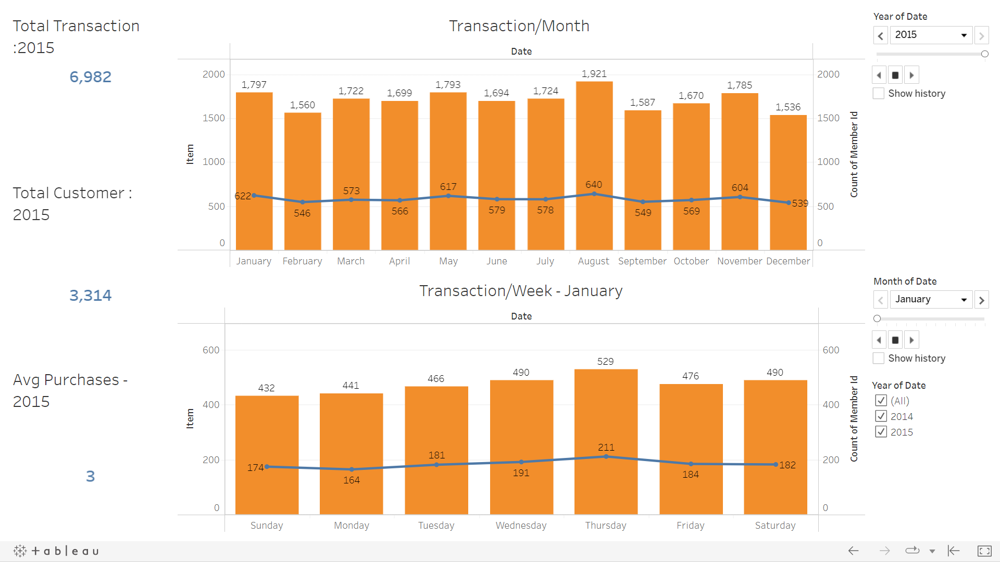
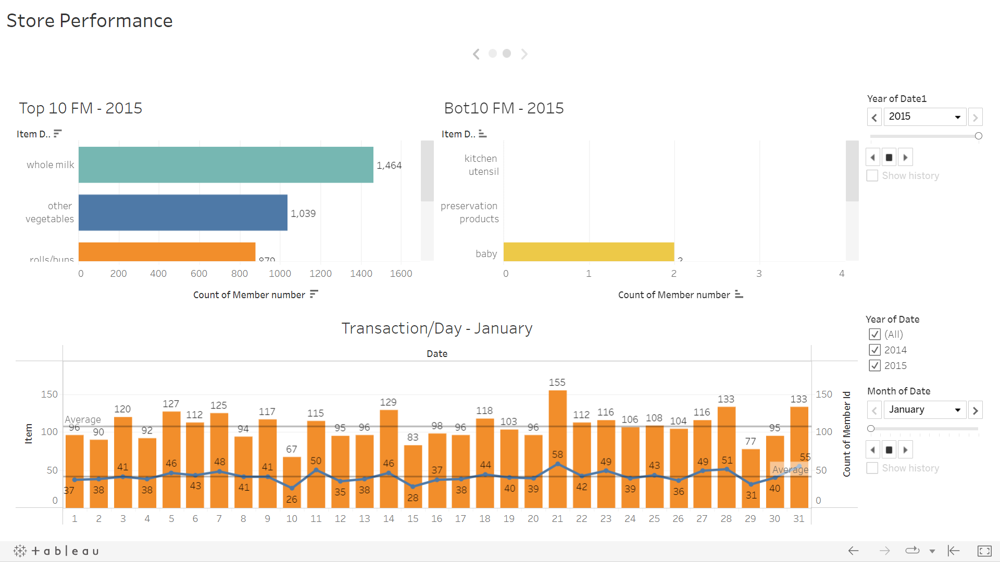

# Market Basket Analysis using Association Rules
In this project, i want to share how to know what item will people buy based on other item using Association rule. This analysis only using transaction history.

 
For full report of this project, please visit <a href='https://github.com/Juantonios1/Market-Basket-Analysis-using-Association-Rules/blob/main/Association%20Rules%20.Ipynb/Market%20Basket%20Analysis%20using%20Association%20Rules.ipynb'>Market Basket Analysis using Association Rules</a>.

## Summary Process
<!-- TABLE OF CONTENTS -->

  
Table of Content

  <ol>
    <li><a href="#business-background">Business Background</a></li>
    <li><a href="#data-understanding">Data Understanding</a></li>
    <li><a href="#exploratory-data-analysis">Exploratory Data Analysis</a></li>
    <li><a href="#data-preprocessing">Data Preprocessing</a></li>
    <li><a href="#data-analytics">Data Analytics</a></li>
    <li><a href="#modeling">Modeling</a></li>
    <li><a href="#conclusion">Conclusion and Recommendation</a></li>
    <li><a href="#contributors">Contributors</a></li>
  </ol>

## Business Background
**Context :**  
The retail process is quite a complicated one, which involves the development of value propositions, looking for customer preferences, the establishment of retail networks and supply chains, getting the customers for buying merchandise, setting up stores, and filling it up with merchandise. While doing all these, you are required to deliver excellent performance and a joyful shopping experience to the consumers.

**Defenition**
* Antecedent: First item who customer buy (if).
* Consequents: Second item who customer buy with first item (then).
* Support: How much an item affects the overall transaction.
* Confidence: Relationship between 2 items conditionally.
* Lift: The ratio of the observed support to that expected if the two rules were independent (lift values > 1 more useful).
* Leverage: The difference of item appearing together in the data set.
* Conviction: Minimum accuracy (conviction values > 1 to infinite, more accurate).

**Problem Statement :**  
In fact, a consumer has different  behaviour and character. It make problems for retail or other shops in  the  sales  process,  such  as  products  running  out  of  stock  and  unsold products and the most popular products and products  that  are not in  demand by consumers.

**Goals :**  
The goals of this analysis is to know what product which people buy when they buy others product. The results of applying  the association rule method with  Apriori  algorithm can  help  recommend  store  owners/managers  in  structuring  product  and  determine  strategic  steps  in increasing sales, such as providing discounts or promos for certain products.

## Data Understanding

| Feature      	     | Description                                                      |
|--------------------|------------------------------------------------------------------|
| Member_number      | Unique ID of Customer.                          	                |
| Date               | Day-month-year of purchases.                                  	  |
| ItemDescription    | The description of item which customer buys.                     |
                                                                                                   
## Exploratory Data Analysis
At this stage, a brief analysis of the data will be carried out, as follows:
* Store Information.
* Identify Missing Values.
* Dataset for Visualization.

## Data Analytics
At this stage, another information analysis will be carried out, as follows:
* Store Perfomance  
  
  

You can also see full dashboard of analysis at <a href="https://public.tableau.com/app/profile/juan1691/viz/StorePerformance_16562354393370/StorePerformance">Analysis Tableau</a>.  

## Data Preprocessing
At this stage, data preparation and processing will be carried out before being used as a data model, as follows:
* One Hot Encoding.

## Modeling
At this stage will be create analysis using model.

## Conclusion 
We conclude our result and give recommendation based on it
* Result
  * Top 5 most selling items from 2014-2015:
    1. Whole milk: 46% from total purchases.
    2. Other vegetables: 38% from total purchases.
    3. Rolls/buns: 35% from total purchases.
    4. Soda: 31% from total purchases.
    5. Youghrt: 28% from total purchases.
  * Whole have the most purchases item that can be combined with other vegetables, roll/buns, soda, and youghrt.
  * Store failed to sell even single kitchen utensil or perseverence product on 2015
* Recommendation
  * Store can give special value for whole milk and it's consequents.
  * Youghrt, roll/buns, and soda can be combined with whole milk
  * Store need pay attention to whole milk stocks.
  * Store can give discount on sunday to attract customer comes to store.
  * Store can arrange yougrt, other vegetables, soda, and roll/buns beside whole milk.

For full report of this project, please visit <a href='https://github.com/Juantonios1/Market-Basket-Analysis-using-Association-Rules/blob/main/Association%20Rules%20.Ipynb/Market%20Basket%20Analysis%20using%20Association%20Rules.ipynb'>Market Basket Analysis using Association Rules</a>.

## Contributors:
Juan Antonio Suwardi - antonio.juan.suwardi@gmail.com  
